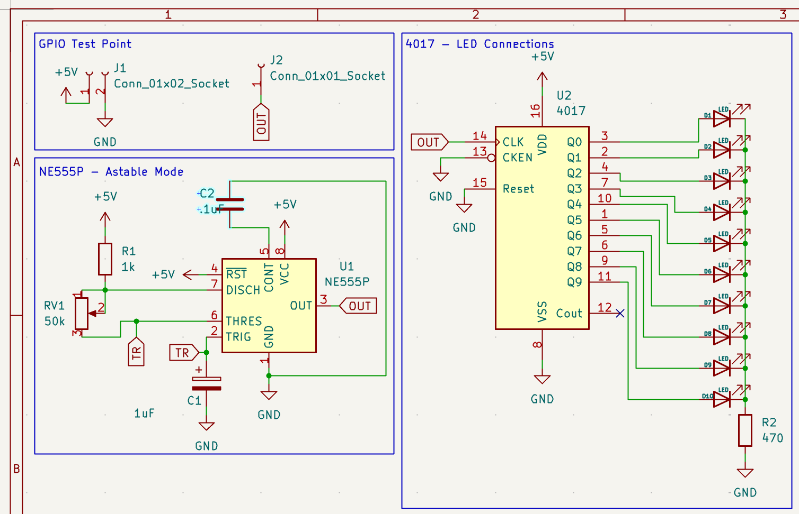
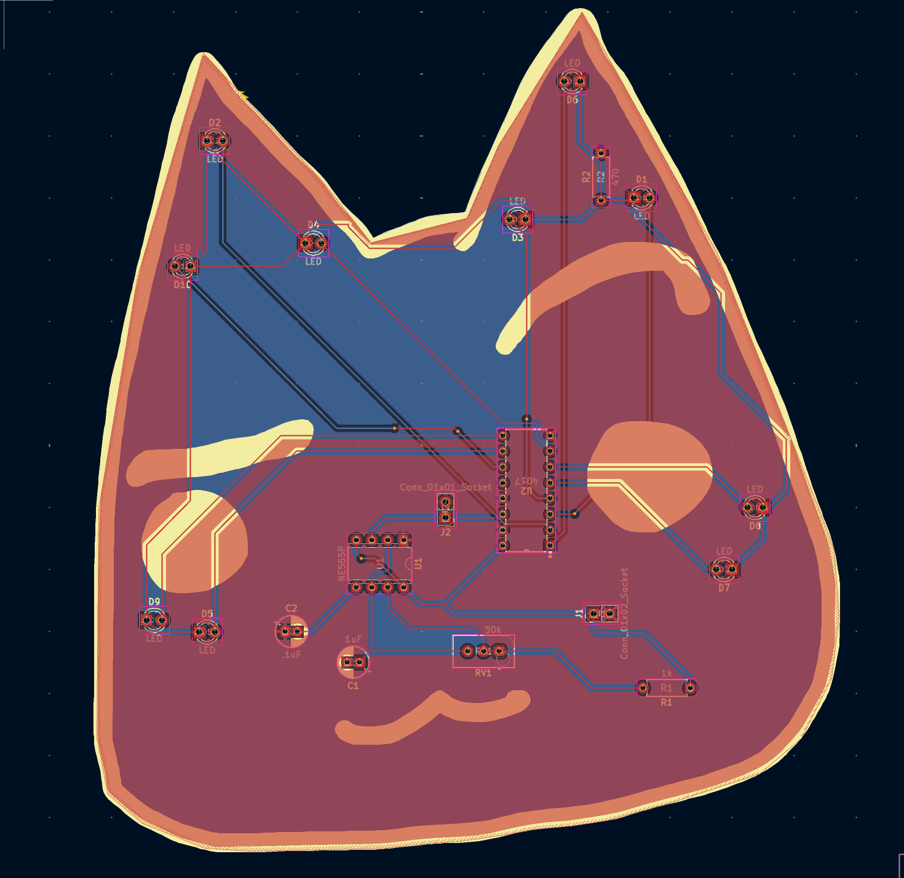
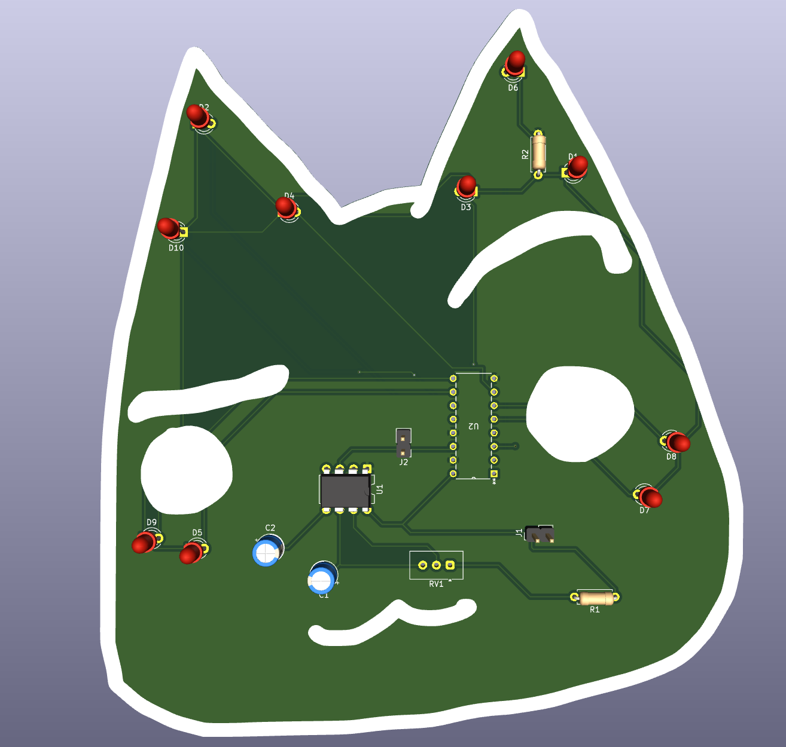

# blinky board

This toro inoue inspired 555 LED chaser board contains 2 IC's: CD4017 to control LED's flashing and get input from NE555P, 2 header pins to power the circuit, standard capacitors and resistors, and of course LEDs. LEDs blink using the 555's astable mode to produces a continuous oscillating signal by toggling its output between high and low Made with help from @Tanishq Goyal qnd @CAN's guides on stasis.

# Photos

| Schematic                          | PCB                    | 3D Render            |
| ---------------------------------- | ---------------------- | -------------------- |
|  |  |  |

# BOM

(Technically just using the blinky board kit from Hack Club)

| Item                                    | Purpose                          | Quantity | Cost | Source |
| --------------------------------------- | -------------------------------- | -------- | ---- | ------ |
| C1                                      | 1F capacitor                     | 1        | ?    | ?      |
| C2                                      | .1F capacitor                    | 1        | ?    | ?      |
| D1, D2, D3, D4, D5, D6, D7, D8, D9, D10 | LEDs various colors              | 10       | ?    | ?      |
| J1                                      | 01x02 pin socket                 | 1        | ?    | ?      |
| J2                                      | 01x01 pin socket                 | 1        | ?    | ?      |
| R1                                      | 1k resistor                      | 1        | ?    | ?      |
| RV1                                     | 470 ohm resistor                 | 1        | ?    | ?      |
| U1                                      | NE555P IC (with timer we'll use) | 1        | ?    | ?      |
| U2                                      | 4017 IC (extend GPIO of NE555P)  | 1        | ?    | ?      |

Total: ?

```
⠀⠀⠀⠀⠀⠀⠀⠀⠀⠀⠀⠀⠀⠀⠀⠀⠀⠀⠀⠀⠀⠀⠀⠀⠀⠀⠀⠀⠀⠀⠀⠀⣠⠀⠀⠀⠀⠀⠀⠀⠀⠀⠀⠀⠀⠀⠀⠀⠀⠀⠀⠀⠀⠀⠀⠀
⠀⠀⠀⠀⠀⠀⠀⠀⠀⠀⠀⠀⠀⠀⠀⢀⠀⠀⠀⠀⠀⠀⠀⠀⠀⠀⠀⠀⠀⠀⠀⡜⠀⠑⡀⠀⠀⠀⠀⠀⠀⠀⠀⠀⠀⠀⠀⠀⠀⠀⠀⠀⠀⠀⠀⠀
⠀⠀⠀⠀⠀⠀⠀⠀⠀⠀⠀⠀⠀⠀⢀⠇⠑⢄⠀⠀⠀⠀⠀⠀⠀⠀⠀⠀⠀⢀⡾⠀⠀⠀⠈⢂⠀⠀⠀⠀⠀⠀⠀⠀⠀⠀⠀⠀⠀⠀⠀⠀⠀⠀⠀⠀
⠀⠀⠀⠀⠀⠀⠀⠀⠀⠀⠀⠀⠀⠀⡌⠀⠀⠀⠑⢆⡀⠀⠀⠀⠀⠀⠀⠀⠀⠺⠄⣀⠀⠀⠀⠀⠑⡀⠀⠀⠀⠀⠀⠀⠀⠀⠀⠀⠀⠀⠀⠀⠀⠀⠀⠀
⠀⠀⠀⠀⠀⠀⠀⠀⠀⠀⠀⠀⠀⡘⠀⠀⠀⠀⣀⠜⠃⠀⠀⠀⠀⠀⠀⠀⠀⠀⠀⠀⠈⠑⠀⠤⣀⠈⢆⠀⠀⠀⠀⠀⠀⠀⢀⡸⠄⠀⠀⠀⠀⠀⠀⠀
⠀⠀⠀⠀⠀⠀⠀⠀⠀⠀⠀⠀⢠⠃⠀⢀⠤⠊⠀⠀⠀⠀⠀⠀⠀⠀⠀⠀⠀⠀⠀⠀⠀⠀⠀⠀⠀⠁⠀⠑⠄⠀⠀⠀⠀⣀⡞⠁⠀⠀⢀⡀⠀⠀⠀⠀
⠀⠀⠀⠀⣤⠄⠀⠀⠀⠀⠀⢀⠋⡠⠔⠁⠀⠀⠀⠀⠀⠀⠀⠀⠀⠀⠀⠀⠀⠀⠀⠀⠀⣀⣤⠶⠒⠛⠉⠉⠈⢂⠀⠀⠀⠛⠀⣀⣤⠾⠛⠁⠀⠀⠀⠀
⠀⠀⠀⠀⠈⠳⣤⡀⠀⠀⠀⡎⠉⣀⣀⣀⣠⣄⣀⣀⠀⠀⠀⠀⠀⠀⠀⠀⠀⠀⠀⣶⣿⣿⠶⠶⠶⠶⠶⠶⢤⣀⠱⠀⠀⠀⠀⠉⠈⠀⠀⠀⠀⠀⠀⠀
⠀⠺⢦⣄⡠⠀⠉⠁⠀⠀⠸⠐⠋⠁⠀⢀⣀⣤⣽⣿⠿⠃⠀⠀⠀⠀⠀⠀⠀⠀⠀⠀⠈⠉⠛⠷⣦⣄⡀⠀⠀⠁⠀⠱⡀⠀⠀⠐⠓⠚⠛⠛⠀⠀⠀⠀
⠀⠀⠀⠀⠉⠛⠀⠀⠀⢀⠇⣠⠴⠶⠛⠉⣡⡾⠟⠁⠀⠀⠀⠀⠀⠀⠀⠀⠀⠀⠀⠀⠀⠀⠀⢀⠀⠈⠙⠷⢦⡀⠀⠀⢠⠀⠀⠀⠀⠀⠀⠀⠀⠀⠀⠀
⠠⡤⠤⠤⠼⠀⠀⠀⠀⢸⠀⠀⠀⢀⣤⡾⠋⠀⠀⠀⠀⠀⣀⣀⣤⣤⣶⡶⠶⠶⠿⢿⣷⠀⡐⠁⠀⠀⠀⠀⠀⠈⠒⠤⡀⠆⠀⠀⠀⠀⠀⠀⠀⠀⠀⠀
⠀⠀⠀⠀⠀⠀⠀⠀⠀⡇⠀⢀⣴⠿⠩⠤⠄⣀⠀⠀⠀⣿⡟⠋⠉⠀⠀⠀⠀⠀⠀⠀⣿⠀⢇⠀⠀⠀⠀⠀⠀⠀⠀⠀⠈⢾⠀⠀⠀⠀⠀⠀⠀⠀⠀⠀
⠀⠀⠀⠀⠀⠀⠀⠀⠀⠄⠀⡸⠁⠀⠀⠀⠀⠀⠙⢄⠀⢻⣇⠀⠀⠀⠀⠀⠀⠀⠀⠀⣿⠀⠈⠢⠄⣀⠀⠀⠀⠀⠀⢀⡠⠜⢣⠀⠀⠀⠀⠀⠀⠀⠀⠀
⠀⠀⠀⠀⠀⠀⠀⠀⠀⠂⠰⠁⠀⠀⠀⠀⠀⠀⠀⢸⠄⠘⣿⡄⠀⠀⠀⠀⠀⠀⠀⠀⣿⠀⠀⠀⠀⠀⠈⠁⠀⠈⠉⠁⠀⠀⠀⠆⠀⠀⠀⢀⠀⠀⠄⠀
⠀⠀⠀⠀⠀⠀⠀⠀⠀⠁⢇⠀⠀⠀⠀⠀⢀⡠⠔⠁⠀⠀⠹⣿⣄⠀⠀⠀⠀⠀⠀⢰⡿⠀⠀⠀⠀⠀⠀⠀⠀⠀⠀⠀⠀⠀⠀⡰⠀⡠⠐⠁⠀⠀⠀⡆
⠀⠀⠀⠀⠀⠀⠀⠀⠀⠀⠈⠓⠂⠒⠊⠉⠀⠀⠀⠀⠀⠀⠀⠘⢿⣧⣄⠀⠀⠀⢀⣾⠃⠀⠀⠀⠀⠀⠀⠀⠀⠀⠀⠀⠀⠀⣠⠇⠊⠀⠀⠀⢀⠄⠊⠀
⠀⠀⠀⠀⠀⠀⠀⠀⠀⡄⠀⠀⠀⠀⠀⠀⠀⠀⠀⠀⠀⠀⠀⠀⠀⠈⠛⠷⣦⣤⡾⠃⠀⠀⠀⠀⠀⠀⠀⠀⠀⠀⠀⢀⡴⠚⠁⠀⠀⠀⡠⠂⠁⠀⠀⠀
⠀⠀⠀⠂⠤⠀⣀⠀⠀⢳⡀⠀⠀⠀⠀⠀⠀⠀⠀⠀⠀⠀⠀⠀⠀⠀⠀⠀⠈⠈⠀⠀⠀⠀⠀⠀⠀⠀⠀⠀⣀⠴⠊⠁⠀⠀⠀⡠⠔⠁⠀⠀⠀⠀⠀⠀
⡀⠀⠀⠀⠀⠀⠀⠈⠑⠂⠙⠢⠤⣀⡀⠀⠀⠀⠀⠀⠀⠀⠀⠀⠀⠀⠀⠀⠀⠀⠀⠀⠀⠀⠀⠇⢀⡠⠔⠋⠀⠀⠀⠀⡠⠐⠉⠀⠀⠀⠀⠀⠀⠀⠀⠀
⠈⠀⠐⠂⠤⢀⡀⠀⠀⠀⠀⠀⠀⠀⠉⠉⠀⠐⠒⠂⠀⠤⢤⠀⠀⠀⠀⠀⠀⠀⠀⠀⠀⠀⠀⠞⠁⠀⠀⠀⣀⠄⠂⠁⠀⠀⠀⠀⠀⠀⠀⠀⠀⠀⠀⠀
⠀⠀⠀⠀⠀⠀⠀⠀⠉⠀⠒⠀⠀⠀⠀⠀⠀⠀⠀⠀⠀⠀⠀⠀⠀⠀⠀⠀⠀⠀⠀⠀⠀⠀⠀⠀⣀⠠⠒⠁⠀⠀⠀⠀⠀⠀⠀⠀⠀⠀⠀⠀⠀⠀⠀⠀
⠀⠀⠀⠀⠀⠀⠀⠀⠀⠀⠀⠀⠀⠀⠀⠀⠀⠀⠀⠀⠀⠀⠀⠀⠀⠀⠀⠀⠀⠀⠀⠀⠀⠀⠀⢨⠀⠀⠀⠀⠀⠀⠀⠀⠀⠀⠀⠀⠀⠀⠀⠀⠀⠀⠀⠀
⠀⠀⠀⠀⠀⠀⠀⠀⠀⠀⠀⠀⠀⠀⠀⠀⠀⠀⠀⠀⠀⠀⠀⠀⠀⠀⠀⠀⠀⠀⠀⠀⠀⠀⠀⠐⠀⠀⠀⠀⠀⠀⠀⠀⠀⠀⠀⠀⠀⠀⠀⠀⠀⠀⠀⠀
```
